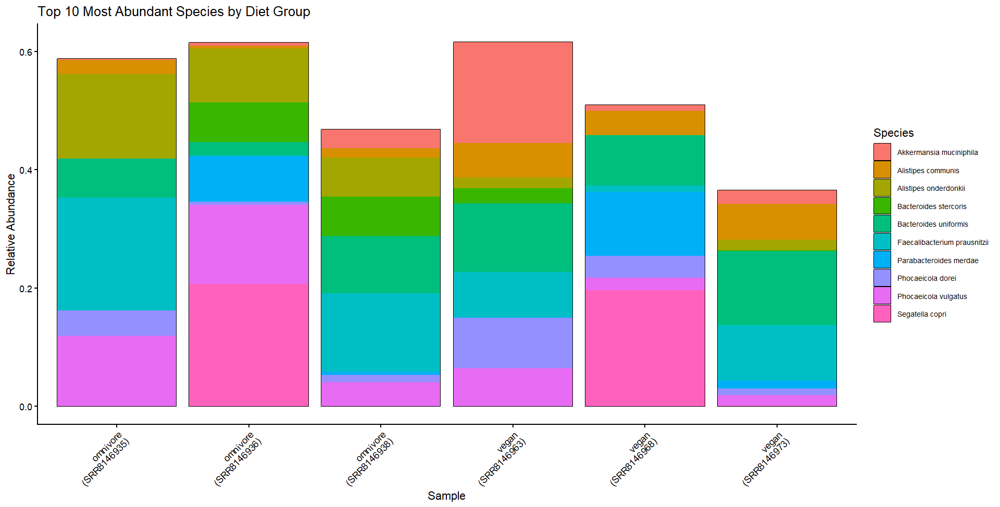
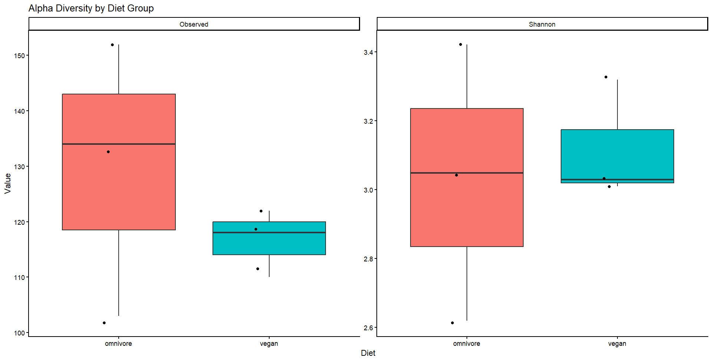
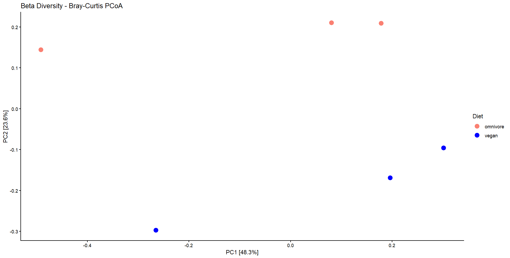
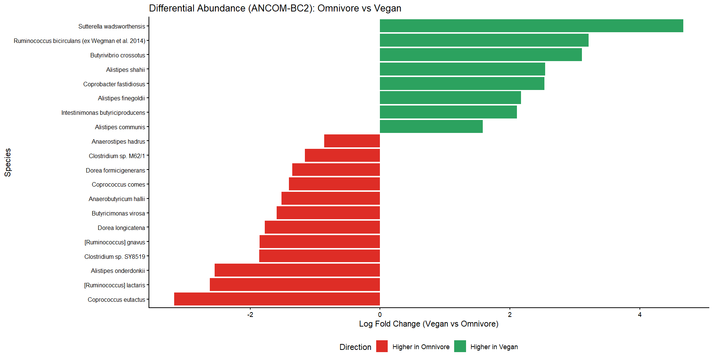

# Gut Microbiome Metagenomics: Omnivore vs Vegan Dietary Comparison

## General Overview
This project examines differences in gut microbiome composition between vegan and omnivore diets using publicly available shotgun metagenomic sequencing data. Reads were quality controlled with fastp, taxonomically classified using Kraken2, and refined with Bracken to generate species-level abundance profiles. Downstream analyses in R (phyloseq, vegan, ANCOM-BC2) included taxonomic visualization, alpha and beta diversity, and differential abundance testing. While no statistically significant differences were detected, this project demonstrates a reproducible workflow for microbiome analysis.

## Table of Contents
- [Introduction](#introduction)
- [Methods](#methods)
  - [1. Data Description](#1-data-description)
  - [2. Quality Control](#2-quality-control)
  - [3. Taxanomic Classification](#3-taxaonmic-classification)
  - [4. Taxanomic Abundance](#4-taxanomic-abundance)
  - [5. Alpha Diversity](#5-alpha-diversity)
  - [6. Beta Diversity](#6-beta-diversity)
  - [7. Differential Abundance](#7-differential-abundance)
- [Results](#results)
- [Discussion](#discussion)
- [References](#references)

## Introduction
The gut microbiome performs essential metabolic functions including vitamin biosynthesis, breakdown of indigestible compounds, and production of beneficial or harmful metabolites that interact with the host (Filippis et al., 2019). Diet is among the most influential external factors shaping the gut microbiome. The shift towards Western dietary patterns, which is characterized by high fat and protein consumption with low fibre intake, has been associated with a loss of microbial diversity with downstream consequences for human health (Filippis et al., 2019). One genus of particular interest is _Prevotella_, which is typically associated with agrarian diets rich in fruits and vegetables. _Prevotella_ has controversial impacts on the human gut: it is associated with the production of short chain fatty acids (health promoting), improved glucose metabolism, and contains anti-inflammatory effects, yet has also been implicated in inflammatory conditions, insulin resistance, and impaired glucose tolerance (Filippis et al., 2019). This inconsistency suggests that different _Prevotella_ strains may drive opposing metabolic responses, making taxonomic classification at the species level critical to understanding its true role in gut health.

To investigate this, shotgun metagenomics is employed, as it enables genus and species level taxonomic profiling of the entire gut microbial community, and provides a more complete picture of microbiome composition (Filippis et al., 2019). The metagenomic data used in this study are derived from the De Filippis et al. (2019) cohort of Italian omnivores and vegans. While omnivore, vegetarian, and vegan diets each produce distinct gut microbiome signatures, the contrast between omnivores and vegans represents the most pronounced divergence. Fackelmann et al. (2025) demonstrated across 21,561 individuals that microbial profiles most accurately distinguished vegans from omnivores (mean Area Under the Curve (AUC) = 0.90) compared to vegetarians versus omnivores (AUC = 0.82) or vegetarians versus vegans (AUC = 0.84), making these two groups the most informative comparison for investigating dietary differences in _Prevotella_ abundance.

To enable accurate downstream taxonomic classification, raw metagenomic reads must first undergo quality control and preprocessing. Tools such as fastp facilitate this step by integrating quality assessment and adapter trimming within a single pipeline, effectively replacing the traditional combination of FastQC and Trimmomatic while operating faster and producing high-quality outputs (Chen et al., 2018). Following preprocessing, taxonomic classification can be conducted using Kraken2, which has demonstrated higher precision, recall, and F1 scores than MetaPhlAn, with diversity estimates that more closely reflect known community composition (Wood et al., 2019). However, Kraken2 relies on reference database completeness, meaning novel or poorly represented organisms may remain undetected. Species-level abundance can then be refined using Bracken, which redistributes reads assigned to higher taxonomic levels to the species level, enabling accurate abundance estimation even when closely related species are present (Lu et al., 2017).

Once taxonomic profiles are established, they provide a foundation for characterizing microbial diversity within and between samples. Within-sample diversity is commonly described using alpha diversity metrics such as Observed features and the Shannon index. Observed features capture species richness, whereas the Shannon index incorporates both richness and evenness, providing complementary perspectives on community structure. However, a limitation of the Shannon index is that variation in its value cannot be attributed to richness or evenness independently (Cassol et al., 2025). In contrast, differences in community composition across samples can be evaluated through beta diversity. Bray–Curtis dissimilarity is frequently applied because it incorporates taxon abundance, unlike presence–absence metrics such as the Jaccard index. These dissimilarities can then be visualized using principal coordinates analysis (PCoA), with statistical differences between groups often evaluated using PERMANOVA. Nevertheless, PERMANOVA assumes equal dispersion among groups, an assumption that may not hold when sample sizes are small.

To identify taxa that differ between dietary groups, differential abundance analysis can be performed using ANCOM-BC2, which corrects for compositional bias and sampling fraction differences through log-ratio transformations (Lin & Peddada, 2020). Unlike DESeq2, which was originally developed for RNA-seq data and does not fully account for the compositional nature of microbiome datasets, and unlike methods such as LEfSe and edgeR that have been reported to produce elevated false discovery rates; ANCOM-BC2 has demonstrated more consistent and reliable performance across microbiome analyses (Nearing et al., 2022). Additionally, ANCOM-BC2 explicitly accounts for structural zeros (taxa that are entirely absent from one group) which may be particularly relevant in dietary comparisons where certain taxa, such as _Prevotella_ strains, may exhibit diet-specific distributions (Nearing et al., 2022).

Overall, this study aims to characterize and compare the gut microbiome composition of Italian omnivores and vegans in order to investigate how dietary patterns shape microbial diversity and species-level _Prevotella_ abundance.

## Methods
### 1. Data Description
Raw Illumina shotgun metagenomic sequencing data were obtained from the NCBI Sequence Read Archive (SRA). The dataset consists of six human gut microbiome samples from individuals in Turin, including three vegan and three omnivore samples.

**Vegan Samples:**
- SRR8146963
- SRR8146968
- SRR8146973

**Omnivore samples:**
- SRR8146935
- SRR8146936
- SRR8146938

Data retrieval was performed on a high-performance computing (HPC) system using the SRA Toolkit (v3.0.9). Raw sequencing files were downloaded using the `prefetch` command and subsequently converted to paired-end FASTQ format using `fasterq-dump`.

### 2. Quality Control
Raw paired-end Illumina reads were quality controlled and adapter-trimmed using fastp (v1.0.1) (Chen et al., 2018), which performs quality assessment and filtering in a single step. Adapter sequences for paired-end reads were automatically detected using the `--detect_adapter_for_pe option`. Bases with a Phred quality score below Q20 were removed, corresponding to a base call accuracy of 99%, and reads shorter than 50 bp after trimming were discarded (Wang et al., 2025). Filtered reads were stored in a dedicated directory, with log files and HTML reports saved separately for record-keeping.

### 3. Taxanomic Classification
Taxonomic composition of each sample was determined using Kraken2 (v2.1.6) (Wood et al., 2019), a k-mer–based classifier that assigns reads to taxa with high precision. To provide a database for classification, the Kraken2 standard database (8 Gb, 2023-10-09) was downloaded and extracted:

```wget https://genome-idx.s3.amazonaws.com/kraken/k2_standard_08gb_20231009.tar.gz```

```tar -xzvf k2_standard_08gb_20231009.tar.gz```

Trimmed paired-end reads from fastp were classified against this database. To reduce false positives, the confidence threshold was increased from the default 0 to the recommended 0.15. 

Moreover, to improve species-level abundance estimates, particularly for _Prevotella_ species, Bracken (v3.0) was applied to re-estimate read counts (Lu et al., 2017). Re-estimation was performed at the species level (`-l S`) using a read length of 150 bp (`-r 150`) with a minimum threshold of 10 reads (`-t 10`) to ensure reliable abundance estimation (Lu et al., 2017). 

The resulting Bracken reports were then imported directly into R for downstream analysis; conversion to BIOM format was not required.

### 4. Taxanomic Abundance
Taxonomic abundance was visualized in R (v4.5.2) using the `phyloseq` and `ggplot2` packages. Relative abundance was calculated by normalizing read counts per sample, and the top 10 most abundant species were visualized as stacked bar charts to summarize community composition across vegan and omnivore samples.

### 5. Alpha Diversity
Within-sample diversity was quantified using Observed features and the Shannon index, which capture species richness and the integration of richness and evenness respectively, together providing complementary perspectives on within-sample diversity (Cassol et al., 2025). Alpha diversity metrics were visualized as boxplots in R and statistical differences between dietary groups were evaluated using the Wilcoxon rank-sum test, which was selected as a non-parametric alternative appropriate for small sample sizes and data that cannot be assumed to follow a normal distribution.

### 6. Beta Diversity
Differences in community composition between dietary groups were assessed using Bray-Curtis dissimilarity, which accounts for taxon abundance. Ordination was performed using Principal Coordinates Analysis (PCoA) and statistical significance between groups was assessed with PERMANOVA, implemented via the `vegan` package in R. However, PERMANOVA assumes equal dispersion between groups, which may not hold with small sample sizes and results should therefore be interpreted cautiously.

### 7. Differential Abundance
Differential abundance between vegans and omnivores was evaluated using ANCOM-BC2 (v1.0), which accounts for compositional bias, sampling fraction differences, and structural zeros (Lin & Peddada, 2020; Nearing et al., 2022). Benjamini-Hochberg correction was applied for multiple testing (`p_adj_method = "BH"`), as it controls the false discovery rate and is more appropriate than the more conservative Holm correction when testing many species simultaneously with limited sample sizes. In addition, structural zeros detection was enabled (`struc_zero = TRUE, neg_lb = TRUE`) to identify taxa entirely absent from one dietary group, which is particularly relevant for diet-specific _Prevotella_ species.

## Results
### Quality Control
Raw paired-end reads were quality controlled and adapter-trimmed using fastp. Pre-filtering Q20 rates ranged from 91.84% to 96.00% across all samples, indicating high-quality input data. Following filtering, Q20 rates increased to 93.12–96.56%, confirming the effective removal of low-quality bases.

The majority of reads passed filtering in all samples, with pass rates ranging from 95.7% (SRR8146968) to 98.2% (SRR8146973). The proportion of reads removed due to low quality was low (1.7– 4.2%), and reads discarded for being shorter than 50 bp after trimming were minimal across all samples (<0.12%). Adapter sequences were detected and removed in all samples, with adapter-trimmed reads ranging from 167,934 (SRR8146973) to 2,033,938 (SRR8146963).

Notably, SRR8146973 had substantially fewer total reads (14.7 million) compared to the other samples (60–91 million), although its high Q20 rate (95.71%) indicates that read quality remained sufficient. Overall, all samples demonstrated adequate quality for downstream taxonomic classification.

### Taxanomic Abundance


**Figure 1:** Stacked bar chart showing the relative abundance of the top 10 most abundant species across omnivore and vegan gut microbiome samples. Samples are labelled by dietary group and SRA accession number.

[Figure 1](figures/abundance.png) displays the relative abundance of the top 10 most abundant species across vegan and omnivore gut microbiome samples. Overall, both dietary groups exhibited diverse microbial communities, with several dominant species shared across samples, including _Faecalibacterium prausnitzii_, _Bacteroides uniformis_, and _Phocaeicola vulgatus_. However, notable differences in species dominance and relative abundance patterns were observed between dietary groups.

Among vegan samples, there was greater variability in dominant taxa across individuals. In sample SRR8146963, _Akkermansia muciniphila_ and _Bacteroides uniformis_ were among the most abundant species, alongside relatively even contributions from _Alistipes communis_, _Faecalibacterium prausnitzii_, _Phocaeicola dorei_, and _Phocaeicola vulgatus_. Sample SRR8146968 was dominated by _Segatella copri_, with substantial contributions from _Parabacteroides merdae_ and _Bacteroides uniformis_. In contrast, SRR8146973 showed a simpler profile, with Bacteroides uniformis as the dominant species followed by Faecalibacterium prausnitzii. Notably, the presence and dominance of _Segatella copri_ in one vegan sample highlights potential enrichment of _Prevotella_-associated taxa in plant-based diets.

Omnivore samples displayed more consistent dominance patterns across individuals. _Faecalibacterium prausnitzii_ was the most abundant species in two of the three samples (SRR8146935 and SRR8146938), while _Segatella copri_ dominated SRR8146936. Species such as _Alistipes onderdonkii_ and _Phocaeicola vulgatus_ were consistently present at moderate to high relative abundances across all omnivore samples. Compared to vegan samples, omnivore microbiomes appeared to have less variability in dominant taxa but maintained a similar core set of abundant species.

Overall, while both dietary groups shared key commensal species, vegans exhibited greater inter-individual variability and occasional dominance of _Segatella copri_, whereas omnivore samples were more consistently dominated by _Faecalibacterium prausnitzii_ and _Alistipes onderdonkii_. These patterns suggest potential diet-associated differences in microbial composition, particularly in relation to _Prevotella_-related taxa.

### Alpha Diversity


**Figure 2:** Boxplots of alpha diversity metrics (Observed features and Shannon index) for omnivore and vegan gut microbiome samples. Points represent individual samples. No statistically significant differences were observed between dietary groups (Wilcoxon rank-sum test, p > 0.05).

Alpha diversity metrics are shown in [Figure 2](figures/alpha.png). Omnivore samples exhibited a higher median observed species richness (median = 134, range = 103–152) compared to vegan samples (median = 118, range = 110–122), suggesting a greater number of distinct species in omnivore gut microbiomes. Omnivores also displayed greater variability in observed richness, spanning a wider range than vegans.

Shannon index values were similar between groups (omnivores: median = 3.05, range = 2.62–3.42; vegans: median = 3.03, range = 3.01–3.32), although omnivores again showed greater variability, indicating more variation in community evenness compared to the relatively consistent vegan samples.

Moreover, individual sample points are overlaid on the boxplots to show the true distribution of the data, which is particularly important given the small sample size (n = 3 per group). With so few samples, boxplots alone can be misleading, as summary statistics may be driven by a single value. In this case, each group contains one sample at the minimum, median, and maximum values, indicating that the observed spread reflects the full distribution of the limited data rather than the influence of outliers.
However, neither metric differed significantly between dietary groups (Observed features: W = 6, p = 0.7; Shannon: W = 5, p = 1.0; Wilcoxon rank-sum test). This lack of significance is likely due to the small sample size (n = 3 per group), which limits statistical power.

### Beta Diversity


**Figure 3:** Principal Coordinates Analysis (PCoA) of Bray-Curtis dissimilarity between omnivore (salmon) and vegan (blue) gut microbiome samples. PC1 and PC2 explain 48.3% and 23.6% of total variation respectively. PERMANOVA: R² = 0.25, p = 0.4.

PCoA of Bray–Curtis dissimilarity revealed a visual separation between omnivore and vegan samples, with omnivore samples clustering in the upper portion of the plot and vegan samples in the lower portion along PC2 ([Figure 3](figures/beta.png)). PC1 explained 48.3% of the total variation and PC2 explained 23.6%, together accounting for 71.9% of the variation.

Despite this apparent separation, PERMANOVA indicated that diet explained 25% of the variation in microbial community composition (R² = 0.25, F = 1.34, p = 0.4), which was not statistically significant. The limited number of permutations achievable with only six samples (719 of the requested 999) further reflects the constraint imposed by the small sample size on statistical inference.

### Differential Abundance


**Figure 4:** Bar chart of the top 20 species by lowest p-value from ANCOM-BC2 differential abundance analysis comparing omnivore and vegan gut microbiomes. Log fold change values are shown relative to vegan samples. Green bars indicate species higher in vegans, red bars indicate species higher in omnivores. No species reached statistical significance after Benjamini-Hochberg correction (n = 3 per group).

Differential abundance analysis using ANCOM-BC2 identified no statistically significant species after Benjamini–Hochberg correction, consistent with the limited statistical power associated with the small sample size. The top 20 species ranked by lowest p-values are shown in [Figure 4](figures/da.png).

Several species exhibited higher log fold changes in vegan samples, including _Sutterella wadsworthensis_, _Ruminococcus bicirculans_, _Butyrivibrio crossotus_, and multiple _Alistipes_ species. Conversely, _Coprococcus eutactus_, _[Ruminococcus] lactaris_, and _Alistipes onderdonkii_ showed higher log fold changes in omnivore samples.

Notably, _Segatella copri_ was not among the top 20 differentially abundant species, suggesting that although it appeared visually prominent in some samples, its abundance differences between dietary groups were not consistent enough to meet the threshold for inclusion after filtering and statistical testing.


## Discussion


## References


Wick, R. R., P Howden, B., & P Stinear, T. (2025b, August 28). Autocycler: long-read consensus assembly for bacterial genomes. Oxford Academic. https://academic.oup.com/bioinformatics/article/41/9/btaf474/8242761
